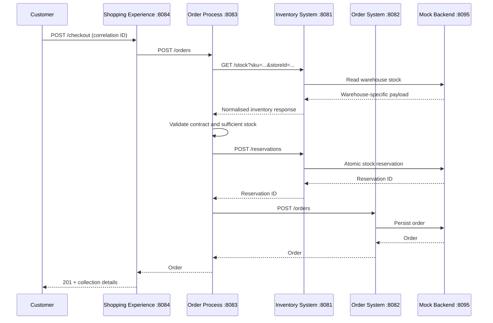

# Application walkthrough

The Experience API shapes a customer-facing response. The Process API coordinates the business steps. System APIs adapt backend contracts. The mock backend intentionally represents different warehouse implementations and provides persistent local order storage.

An `x-correlation-id` is accepted or generated at each ingress and explicitly forwarded on every downstream request. Structured events include UTC-offset timestamps, API name, release, event, correlation ID and relevant business keys. Mule runtime exception output supplies the component location and flow stack.

HTTP dependency errors retain the upstream status while returning a small public error body. Internal error descriptions remain in the logs. Contracts are documented under `contracts/`; additional production concerns are listed in the README.
